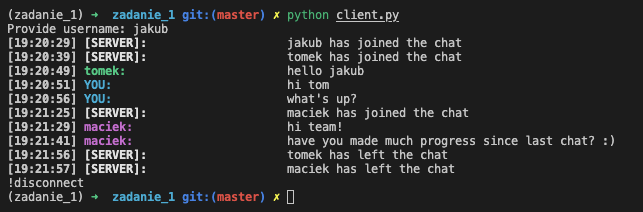
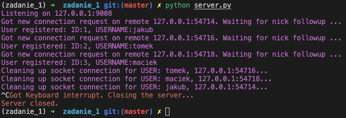

### Jakub Barber

## Simple client server socket based chat.
App enables to run multiple clients locally with the server instance running. Server holds tcp and udp sockets listening on `HOST` and `PORT`. For each new client server starts new thread for listening client tcp/udp communication. Server uses separate thread synchronized by queue to send messages to clients via UDP/TCP.

There is also a possibility of sending multicast messages for udp socket listening on `MCAST_GRP` `MCAST_PORT`. Each client opens one socket for multicast communication on this group address. This way, we can omit server being middleware in messages addressing.
Apart from that client used tcp and udp sockets for maintaining communication with server, each one running in separate thread. There is also dedicated thread for collection user input.

In order to customize coloring of chat change `_USER_COLOR_MAPPINGS` dictionary in `utils.py`. For coloring I am utilizing `colorama` library.

## Instructions
In order to start the server run:
```
python server.py
```
To create new client instance:
```
python client.py
```

You will be first prompted to add your username, that will identify you in the group chat. After successful registration, you will be able to use chat normally. In order to leave the chat type:
`!disconnect`. In order to send udp message type: `[UDP]: {message}` and for multicast communication use `[MULTICAST]: {message}`. Enjoy your chatting experience! :) 



